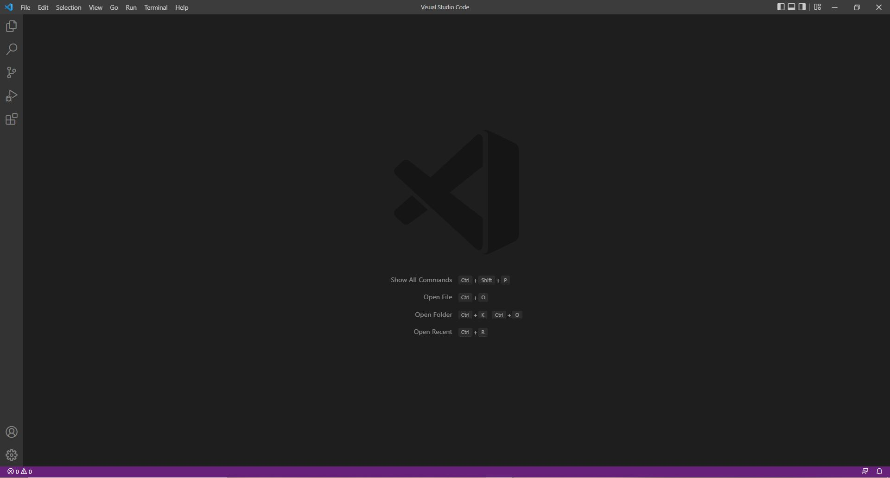
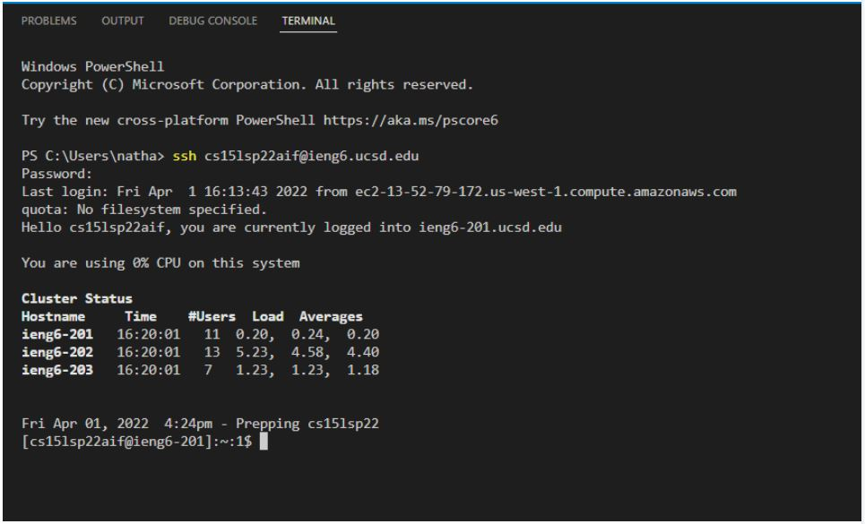

# How to Log Into Your Course Specific Account Through Remote Access

**Note**: *You should have been given a course username (e.g. cs15lsp22zz). You should have also set up your account password following steps similar to [this](https://cdn-uploads.piazza.com/paste/ktv2gnof3sx5bf/181c3cb053df5cf1ccaf0457f56f12a2e5aa90b139aef8c2ea8fcc590f02fadf/How-to-Reset-your-Password.pdf).*

## Installing Visual Studio Code (VSC)
---

First, go to the [VSC Website](https://code.visualstudio.com/), and follow the steps to install and download the app. Make sure to download the correct application depending on whether your operating system is OSX (Mac) or Windows (PC).

After installing and opening the app, your screen should look like this: 


## Remotely Connecting
---

Before remotely connecting, you need to install [OpenSSH](https://docs.microsoft.com/en-us/windows-server/administration/openssh/openssh_install_firstuse).
**Note**: *Windows 10 and 11 may already have OpenSSH pre-installed. Check by going to settings > Apps > Apps & Features > Optional Features. See if OpenSSH is already in your system. I already had it installed so I can skip this step.* 

Now, in VSC, open up a terminal. This can be done by using the shortcut *Ctrl + shift + `* or look at the top left > Terminal > New Terminal. The first step to remotly connecting will be to use this command in the terminal (the zz should be replaced with the letters in your course-specfic account):

`$ ssh cs15lsp22zz@ieng6.ucsd.edu`

Since you are connecting to a new server for the first time, this message may appear: 

```
=> ssh cs15lsp22zz@ieng6.ucsd.edu

The authenticity of host 'ieng6.ucsd.edu (128.54.70.227)' can't be established.

RSA key fingerprint is SHA256:ksruYwhnYH+sySHnHAtLUHngrPEyZTDl/1x99wUQcec.

Are you sure you want to continue connecting (yes/no/[fingerprint])?
```

Answer yes.
Then you may proceed and enter your password to login.
This is what your terminal may look like upon logging in: 


##