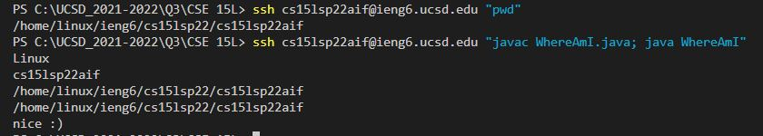

# How to Log Into Your Course Specific Account Through Remote Access

**Note**: *You should have been given a course username (e.g. cs15lsp22zz). You should have also set up your account password following steps similar to [this](https://cdn-uploads.piazza.com/paste/ktv2gnof3sx5bf/181c3cb053df5cf1ccaf0457f56f12a2e5aa90b139aef8c2ea8fcc590f02fadf/How-to-Reset-your-Password.pdf).*

## 1. Installing Visual Studio Code (VSC)
---

First, go to the [VSC Website](https://code.visualstudio.com/), and follow the steps to install and download the app. Make sure to download the correct application depending on whether your operating system is OSX (Mac) or Windows (PC).

After installing and opening the app, your screen should look like this: 


## 2. Remotely Connecting
---

Before remotely connecting, you need to install [OpenSSH](https://docs.microsoft.com/en-us/windows-server/administration/openssh/openssh_install_firstuse).
**Note**: *Windows 10 and 11 may already have OpenSSH pre-installed. Check by going to settings > Apps > Apps & Features > Optional Features. See if OpenSSH is already in your system. I already had it installed so I can skip this step.* 

* Find your course-specific account [here](https://sdacs.ucsd.edu/~icc/index.php).

Now, in VSC, open up a terminal. This can be done by using the shortcut *Ctrl + shift + `* or look at the top left > Terminal > New Terminal. The first step to remotly connecting will be to use this command in the terminal (the zz should be replaced with the letters in your course-specfic account):

`$ ssh cs15lsp22zz@ieng6.ucsd.edu`

Since you are connecting to a new server for the first time, this message may appear: 

```
=> ssh cs15lsp22zz@ieng6.ucsd.edu

The authenticity of host 'ieng6.ucsd.edu (128.54.70.227)' can't be established.

RSA key fingerprint is SHA256:ksruYwhnYH+sySHnHAtLUHngrPEyZTDl/1x99wUQcec.

Are you sure you want to continue connecting (yes/no/[fingerprint])?
```

Answer yes.
Then you may proceed and enter your password to login.
This is what your terminal may look like upon logging in: 


## 3. Try Some Commands
---

Try running these commands:
`cd`, `ls`, `pwd`, `mkdir`, and `cp` on **both your computer and the remote computer**.

Here are some other commands to try:


* Being familiar with the commands may be useful to know what commands work or don't work on your computer versus the remote server

Also, a good thing to know is that `Ctrl + D` or running the command `exit` can log you out of the remote server.

## 4. Moving Files with scp
---

Something to recognize first is that the `scp` command is ran from your computer.

Run this command:
`$ scp (filename).java cs15lsp22zz@ieng.ucsd.edu:~/`
*remember to change zz to your account id*

You will be asked for your password, after typing it in, log into the server (ieng6) using `ssh` again. Use `ls`, and you should be able to the file you just copied in the home directory.

Here is an example of using the `scp` command. Notice that scp originally didn't work because I inputted the wrong username (didn't replace the zz with my information): 


## 5. Setting an SSH Key
---

Constantly having to enter your password when using `ssh` or `scp` is time consuming and tiring, so we will use keys. The keys use a program called *ssh-keygen* which creates a pair of files called the public key and private key.

Enter this on your computer:
```
$ ssh-keygen
```

This will show up:
```
Generating public/private rsa key pair.

Enter file in which to save the key (/Users/<user-name>/.ssh/id_rsa): /Users/<user-name>/.ssh/id_rsa

Enter passphrase (empty for no passphrase): 
```

You can just click enter at this moment to have no passphrase, continue:
```
Enter same passphrase again: 

Your identification has been saved in /Users/<user-name>/.ssh/id_rsa.

Your public key has been saved in /Users/<user-name>/.ssh/id_rsa.pub.

The key fingerprint is:

SHA256:jZaZH6fI8E2I1D35hnvGeBePQ4ELOf2Ge+G0XknoXp0 <user-name>@<system>.local
The key's randomart image is:

+---[RSA 3072]----+
|                 |
|       . . + .   |
|      . . B o .  |
|     . . B * +.. |
|      o S = *.B. |
|       = = O.*.*+|
|        + * *.BE+|
|           +.+.o |
|             ..  |
+----[SHA256]-----+
```

If you're on Windows, this step `ssh-add` might be needed (though I did not need this step) [ssh-add](https://docs.microsoft.com/en-us/windows-server/administration/openssh/openssh_keymanagement#user-key-generation)

>The steps above created the private key file (**id_rsa**) and public key file (**id_rsa.pub**) which are stored in the **.ssh** directory of your computer.

Lastly, you have to copy the **public** key to the **.ssh** directory of your account on the server.
* Log in using ssh
* Use `$ mkdir .ssh`
* Log out of server (Ctrl + D)
* Use `$ scp /Users/<user-name>/.ssh/id_rsa.pub cs15lsp22zz@ieng6.ucsd.edu:~/.ssh/authorized_keys`

Now you shouldn't need to enter a password when using `ssh`! (like this)


## 6. Optimizing Remote Running
---

There are multiple ways to save time:
* You can run multiple commands on the same line using `;`. This can reduce the amount of keystrokes you need.
* Use the up-arrow key to use a previously entered command
* Write a command in quotes after an `ssh` command. Such as `$ ssh cs15lsp22zz@ieng6.ucsd.edu "pwd"`
