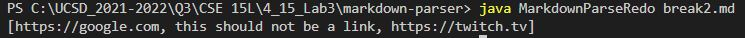

# CSE-15L: Lab Report 2: Week 4: Debugging Code

## Coding and Debugging
---
> Below are some of the bugs and symptoms that we encoutered while parsing through some markdown files

## Code Change #1
---

1. This is the code change that we applied:

2. Here is the [**test file**](https://github.com/NathanTzChung/markdown-parser/blob/main/break.md) that included the failure-inducing input.
*The test file has since been changed, this is what we originally ran our code on*:  

3. Running the code on the failure-inducing input led to this symptom showing up in the terminal:

4. In the test file that we ran the code on, we broke the code by including an open bracket without the rest of the components needed to create a link. The bug was caused by the indexOf() statements within the while loop in which led to the currentIndex to never surpass the length of the test file. Basically, since the test file had a dangling open bracket, the while loop in the code could not stop. The symptom caused by the bug was that the failure-inducing input led to an infinite loop denoted by the `OutOfMemoryError`. The fix was to include code that would exit the while loop if there is any missing component needed to create a link.

## Code Change #2
---

1. This is the code change that we applied:

2. Here is the [**test file**](https://github.com/NathanTzChung/markdown-parser/blob/main/break2.md) that included the second failure-inducing input.
This is a visual for the file that we ran our code on:

3. Running the code on the second failure-inducing input led to this symptom showing up in the terminal:

4. This time, in the second test file, we broke the code by including a line break between the components needed to write a link. From the image above, we see that the failure-inducing input includes text that includes the components needed to write a link, however, it is split between two lines (lines 7 and 8). The bug was that the code didn't have anything to check for cases of new line characters. The bug led to the symptom of printing out the fake link, which means that it produced a wrong output. The fix was to include code that would essentially skip over fake links if they had a new line in them.

## Code Change #3
---

1. This is the code change that we applied:

2. Here is the [**test file**](https://github.com/NathanTzChung/markdown-parser/blob/main/break3.md) that included the third failure-inducing input.
This is a visual for the file that we ran our code on:

3. Running the code on the third failure-inducing input led to this symptom showing up in the terminal:

4. In the third test file, we broke the code by including an image, which has the same components as is needed to write a link except that an image needs an '!' in front. The bug was that our code didn't have any conditional statements to check for whether or not something was actually a link or just an image. The symptom caused by the bug was that an incorrect output was printed, since the image should not be included as a link. The fix was to include a conditional statement that checked if the opening brackets had an '!' before them.