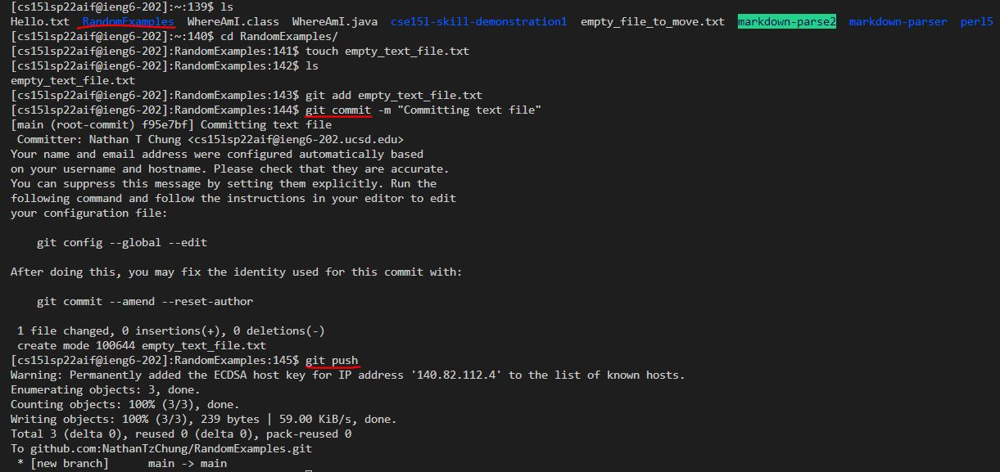
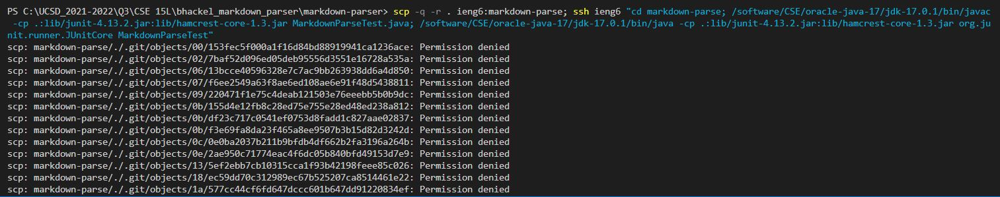

# **CSE 15L: Lab Report 3**

## 1. **Streamlining ssh Configuration**
---

 1. Here is my 'config' file. I edited it using VSCode and kept the alias as 'ieng6'. This step basically allows you to use an alias of your choice to login into ieng6 rather than having to type out the full username and hostname each time.
    * 

 2. Logging into my account using my `ssh` and my alias (ieng6).
    * 

 3. Copying a file using `scp` and my alias. I checked to see if the file was copied over by using the `ls` command.
    >  
    >  

## 2. **Setup Github Access from ieng6**
---

 1. My public key on GitHub. My public key in my user account is displayed in part 2 of this step.
    * 

 2. Here are ***both*** my public and private keys in my **user account**.
    * 

 3. Additionally, I used both `git commit` and `git push` to, well, commit and push changes while logged into my ieng6 account. Specifically, I created a new file, added it, committed the change, and pushed it onto the repository. Here is the [commit history](https://github.com/NathanTzChung/RandomExamples/commit/f95e7bfd12983b49c3d11d8fe6600b2f8e7ab156) that corresponds to the image below.
    * 

## 3. **Copy whole directories with `scp -r`**
---

 1. Here, I copied my entire markdown-parse file into my ieng6 account.
    * 
    > There were many other things that copied over, so I didn't want to screenshot all of them, but here is proof that the files did indeed get copied over.
    >

 2. Then, I loggied into my ieng6 account and compiled and ran the tests for my repository.
    * 

 3. Finally, I combined both of the above steps into one using `scp`, `;`, and `ssp` in a single line.
    * 
    * 