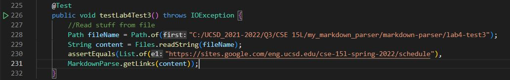

# *CSE 15L: Lab Report 4**

[My MDParse Repository](https://github.com/NathanTzChung/markdown-parser)

[Reviewed MDParse Repository](https://github.com/ANGUYEN625/markdown-parser)

## **Snippet 1**
---
> Here is the preview displaying the input and expected output
>
> 
> 
> These are the expected valid links: "`google.com", "google.com", "ucsd.edu"

> Here is how I turned it into a test
> 
> 

> The corresponding outputs when running the test (*Both my implementation and the other group's impementations failed the test*)
> 
> My failed output
>
> 
>
> Reviewed group's failed ouput
> 
> 

> **Code changes**: I don't think there is a small code change that would allow Snippet 1 to run properly. This is because there are quite a few cases to check for (such as when checking for brackets). For example, it takes more than a few lines of code to detect if a pair of backticks are in the same set of brackets/parantheses. This is only one of quite a few cases to consider.

## **Snippet 2**
---
> Here is the preview displaying the input and expected output
>
> 
> 
> These are the expected valid links: "a.com", "a.com(())", "example.com"

> Here is how I turned it into a test
> 
> 

> The corresponding outputs when running the test (*Both my implementation and the other group's impementations failed the test*)
> 
> My failed output
>
> 
>
> Reviewed group's failed ouput
> 
> 

> **Code changes**: I think this case could be solved with a small amount of code changes. This is because, based on the fact that my output nearly outputted all of the correct links, we could simply ignore the number of opening parantheses. In ignoring the number of opening parantheses inside of the 'link' portion of the text, we can avoid misinterpreting nested parantheses.

## **Snippet 3**
---
> Here is the preview displaying the input and expected output
>
> 
> 
> This is the expected valid link: "https://sites.google.com/eng.ucsd.edu/cse-15l-spring-2022/schedule"

> Here is how I turned it into a test
> 
> 

> The corresponding outputs when running the test (*Both my implementation and the other group's impementations failed the test*)
> 
> My failed output
>
> 
>
> Reviewed group's failed ouput
> 
> 

> **Code changes**: I think this case could also be solved with a small amount of code changes. What needs to be done is to check for whether there are multiple new lines/line breaks which would not be considered as correct link formatting. However, if a link continues into the next line as opposed to a line break, it should still be considered as a link. Essentially, if there are line breaks inside of the link formatting, then it should not be considered a link and should be skipped over. However, if there is a new line in the link formatting that isn't a line break, it should be considered a link (like the expected valid link above).