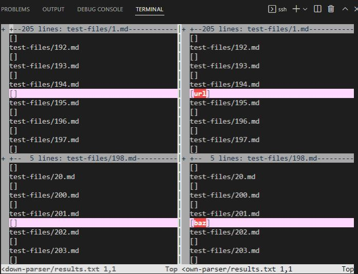
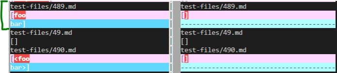
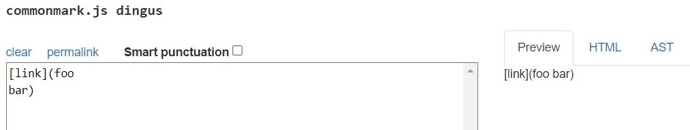
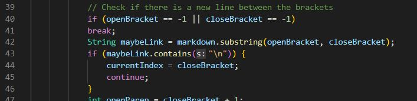
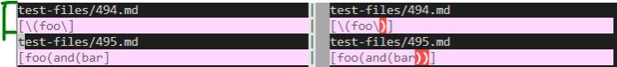
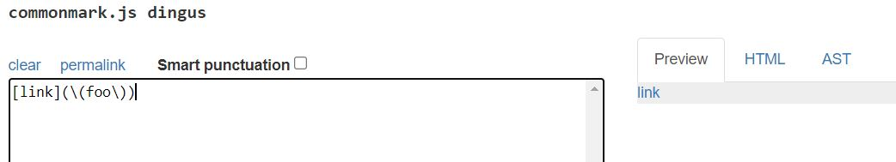
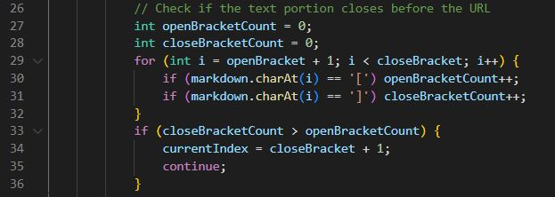
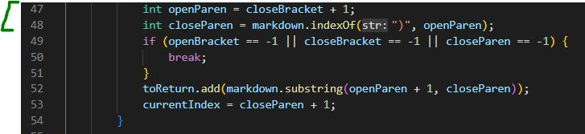

# **CSE 15L: Lab Report 5**

## **Finding the differences**
---

To find the tests that had differing results/answers in comparison to the implementation that was provided for lab 9, I used `vimdiff`. 

Here is an image of what using the command initially displayed:

### **Additionally, here are the links to the *two* test-files with different results that I chose:**
> [test1_test-file-489](https://github.com/nidhidhamnani/markdown-parser/blob/main/test-files/489.md?plain=1)

> [test2_test-file-494](https://github.com/nidhidhamnani/markdown-parser/blob/main/test-files/494.md?plain=1)

## **Test 1: Test File 489**
The test-file: [test1_test-file-489](https://github.com/nidhidhamnani/markdown-parser/blob/main/test-files/489.md?plain=1)
---

Here are the actual outputs shown from using `vimdiff`:

The difference that I'm looking at is bracketed in green. In this case, our implementation was *incorrect* and the TA's implementation gave the *correct* output. (Our implementation is on the left side, the TA implementation is on the right)

Here is what the expected output should be (I used the commonmark site to decide what it should produce):

What should be produced is an empty list of links.

Based on the expected output in the image, and as aforementioned, our implementation is *incorrect*. The bug is that our existing code does **not** check for new lines within the URL portion of the URL markdown format. The check for new lines makes sure that, if there is a new line between parantheses, it shouldn't be considered a link. The way that our implementation would check for new lines within the URL portion would be similar to this:

This is a portion of our code that checks for new lines inbetween the brackets. Similarly, we would need to **write and add *new*** code that checks for new lines inbetween the parantheses (instead of inbetween the brackets). We would put the new code after the lines of code in the above image.

## **Test 2: Test File 494**
The test-file: [test2_test-file-494](https://github.com/nidhidhamnani/markdown-parser/blob/main/test-files/494.md?plain=1)

---

Here are the actual outputs shown from using `vimdiff`:

The difference that I'm looking at is bracketed in green. Once again, our implementation was *incorrect*, and the TA's implementation produced the *correct* output.

Here is what the expected output should be:

What should be produced is a list of one link which is `\(foo\)`.

Since our code produces the *incorrect* output, I found that the bug causing it was that we aren't checking for nested opening/closing parantheses inside within the URL portion. In order to fix this bug, our code would need to have a fix similar to this:

The above is a portion of our code that checks for nested brackets inside of the Text portion of the link markdown format. Thus, we would need to **write and add *new*** code that checks for nested parantheses within the URL portion. This change/addition to our existing code would be added after here (the brackted portion):

